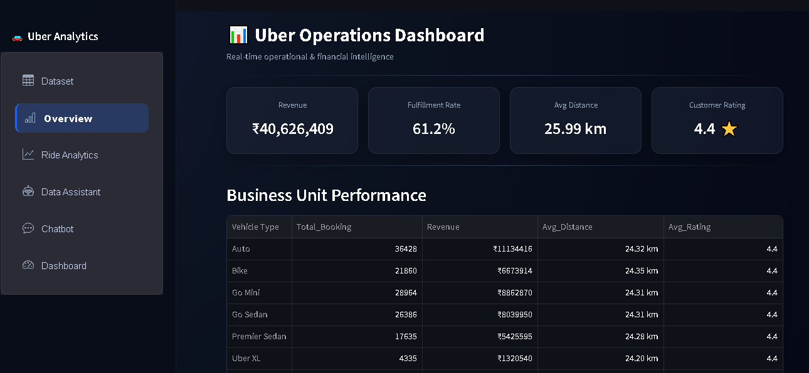
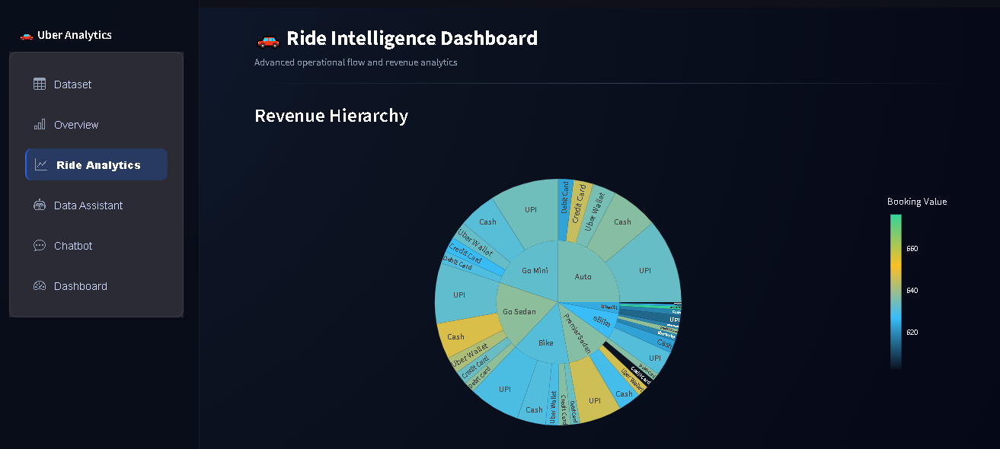
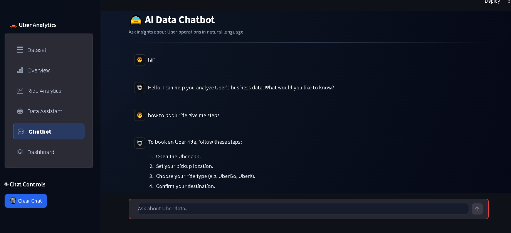

# 🚖 Uber Operations Analytics Dashboard  
### 📊 AI-Powered Business Intelligence & Ride Analytics Platform  

<p align="center">
  
  
  
  
  
  
</p>

<p align="center">
  <b>Transform raw Uber ride data into powerful operational insights using AI, analytics, and interactive visualization.</b>
</p>

---

## ✨ Key Features

The application is divided into six core modules accessible via the sidebar:

*   **📊 Dataset Explorer:** View, filter, and search the raw dataset. Includes dynamic KPI cards, column statistics, and the ability to download filtered data as a CSV.
*   **📈 Overview Dashboard:** An executive summary showing total revenue, fulfillment rates, average distance, and business unit performance. Includes cancellation audits and operational efficiency metrics (VTAT & CTAT).
*   **🚗 Ride Analytics:** Advanced visual intelligence featuring Sunburst charts for revenue hierarchy, Treemaps, Box plots for rating spreads, and a stunning Sankey Flow diagram to track ride lifecycles.
*   **🤖 Data Assistant:** A rule-based text assistant that instantly answers predefined operational questions (e.g., "total rides", "revenue", "vehicle usage", "cancellations") and generates instant visualizations.
*   **💬 AI Chatbot:** A fully integrated AI assistant powered by the **Groq API** (`Llama 3.3 70B`). Ask complex, natural language questions about the data and get human-readable insights instantly.
*   **🎛️ Comprehensive Dashboard:** A unified view of all major metrics using interactive Plotly charts, including booking value distributions, rating histograms, and distance vs. revenue scatter plots.

---

## 🌟 Why This Project Stands Out

✔ End-to-end analytics pipeline (Raw Data → Insights → AI)  
✔ Executive-level dashboards with KPIs  
✔ AI Chatbot for natural language queries  
✔ Advanced interactive visualizations (Sankey, Sunburst, Treemap)  
✔ Clean, modern **glassmorphism UI design**  
✔ Production-style modular architecture  

---

## 🛠️ Technology Stack

*   **Frontend / Framework:** [Streamlit](https://streamlit.io/) (with custom CSS for Dark Mode & Glassmorphism)
*   **Data Manipulation:** [Pandas](https://pandas.pydata.org/)
*   **Data Visualization:** [Plotly Express](https://plotly.com/python/plotly-express/) & Plotly Graph Objects
*   **Navigation:** `streamlit-option-menu`
*   **AI Integration:** [Groq API](https://groq.com/) 

---

## 📊 Dashboard Preview

> 📌 Add screenshots in `/images` folder

### 🎧 Main Dashboard


### 📈 Advanced Dashboard


### 🤖 AI Assistant


---

## ⚙️ Data Preprocessing Pipeline
The app automatically cleans the raw dataset upon loading:
1. Standardizes column names and removes duplicates.
2. Handles missing numeric/categorical values using median/mean imputation.
3. Fixes data types for optimization.
4. Removes invalid data (negative distances or values).
5. **Feature Engineering:** Calculates `Revenue_per_km`.
6. **Outlier Handling:** Uses the IQR (Interquartile Range) method to remove extreme anomalies in booking values.

## 🚀 Installation & Setup

Follow these steps to run the project locally.

### 1. Clone the repository
```bash
git clone https://github.com/your-username/your-repo-name.git
cd your-repo-name
```

### 2. Install dependencies
Ensure you have Python 3.8+ installed. Install the required libraries using pip:
```bash
pip install streamlit pandas plotly streamlit-option-menu groq
```

### 3. Add your Data File
Make sure you have the `Uber.csv` dataset in the root directory of the project.

### 4. Setup API Key (Important)
For the AI Chatbot to work, you need a Groq API Key. 
*Get your free API key at [console.groq.com](https://console.groq.com).*
Create a `.streamlit/secrets.toml` file in the root directory and add your key:
```toml
GROQ_API_KEY = "your_actual_api_key_here"
```

### 5. Run the Application
```bash
streamlit run app.py
```
*(Replace `app.py` with whatever you named your python script).*

## 🎨 UI/UX Design Note
This dashboard moves away from standard Streamlit designs by implementing custom CSS injected via `st.markdown()`. It features:
*   Radial gradient dark mode backgrounds.
*   Ultra-transparent glassmorphism containers (`backdrop-filter: blur()`).
*   Smooth hover animations and transition effects.
*   A curated, modern color palette for all data visualizations.

## 🤝 Contributing
Contributions, issues, and feature requests are welcome!

## 📝 License
This project is open-source and available under the [MIT License](LICENSE).
